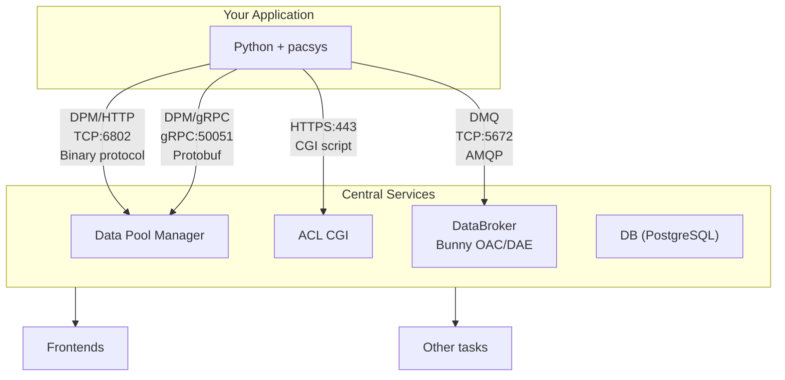
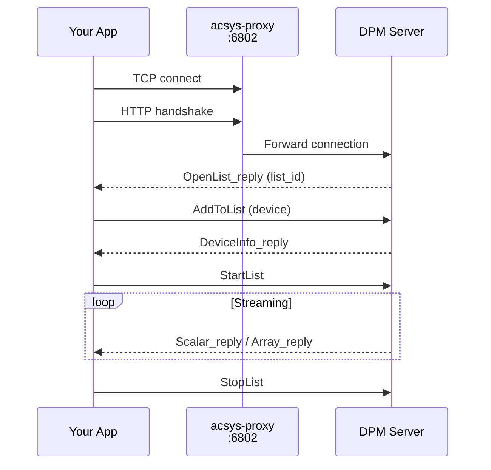
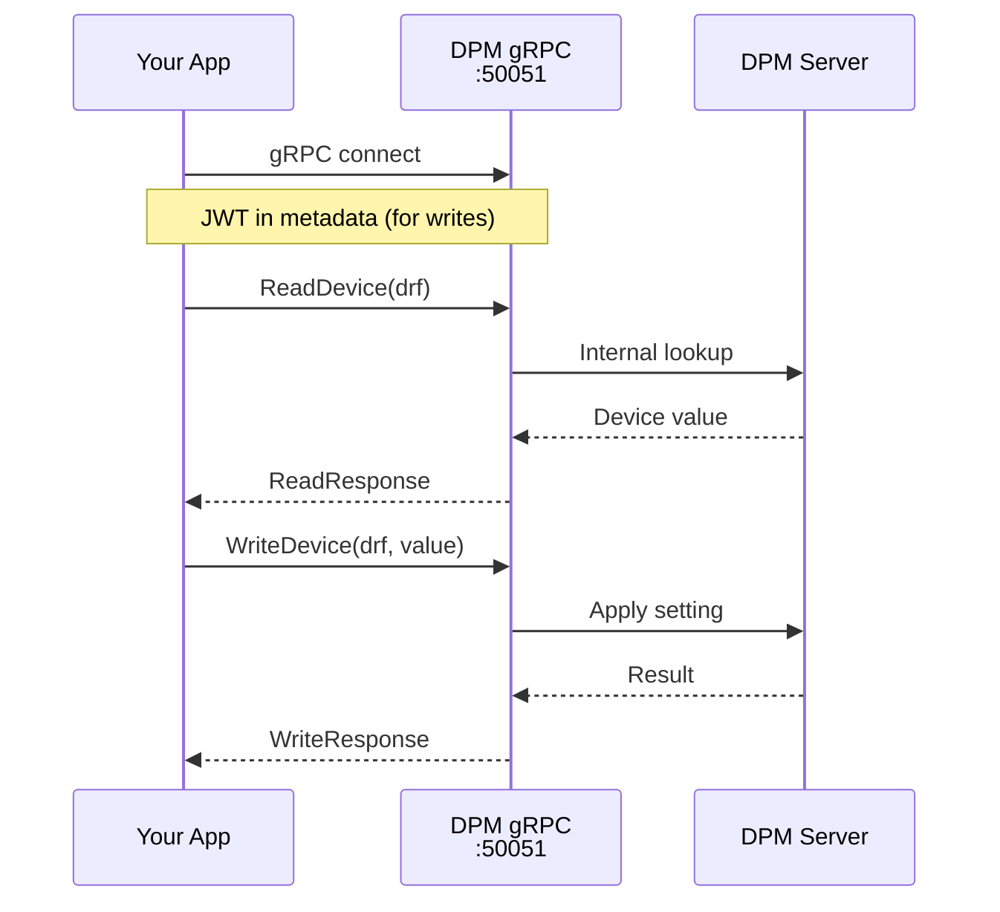
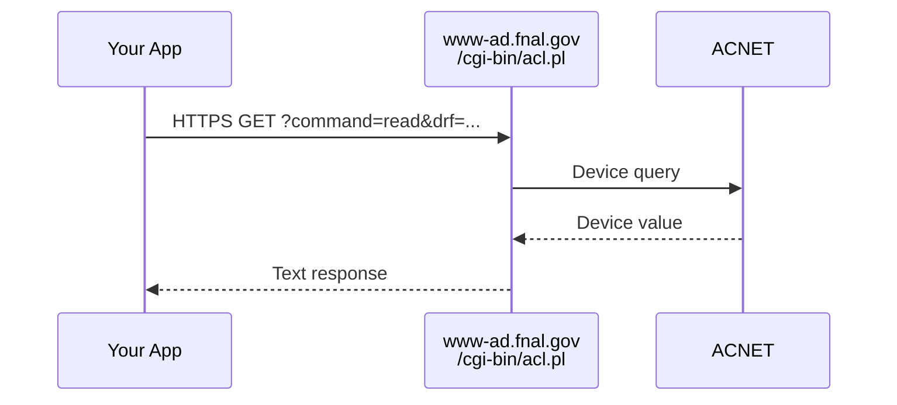
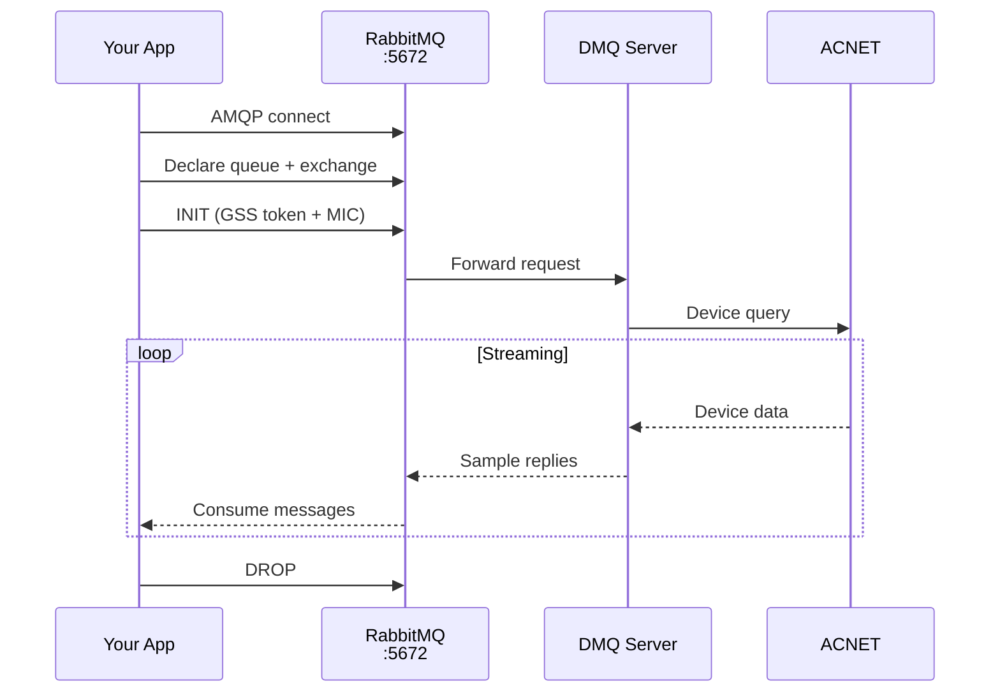
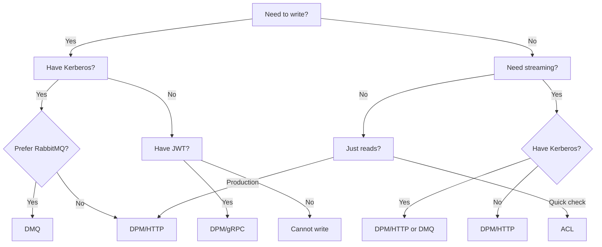

# Backends

## Overview

pacsys provides multiple backends which talk to various 'central services'. The DPM backends connect to the DPM server, DMQ talks to DataBroker/Bunny OAC/DAE, etc.



## Backend Comparison

| Feature | DPM/HTTP | DPM/gRPC | DMQ | ACL |
|---------|:--------:|:--------:|:---:|:---:|
| **Read** | ✓ | ✓ | ✓ | ✓ |
| **Write** | ✓ | ✓ | ✓ | — |
| **Stream** | ✓ | ✓ | ✓ | — |
| **Auth** | Kerberos¹ | JWT | Kerberos² | None |
| **Permissions** | Role-based | Role-based | Console class | N/A |
| **Protocol** | Custom binary (PC) | gRPC/Protobuf | AMQP/SDD | HTTP/CGI |
| **Port** | 6802 | 50051 | 5672 | 443 |
| **Factory** | `pacsys.dpm()` | `pacsys.grpc()` | `pacsys.dmq()` | `pacsys.acl()` |

¹ DPM/HTTP: Kerberos required for writes only, reads work anonymously
² DMQ: Kerberos required for ALL operations (reads, writes, streaming)

---

## DPM/HTTP

The primary backend. Uses a custom binary protocol ("PC" format) over TCP.



### Characteristics

- **Connection pooling**: Multiple reads share pooled connections
- **Independent subscriptions**: Each `subscribe()` creates its own TCP connection
- **Kerberos auth**: Required for writes, optional for reads
- **Heartbeats**: Server sends `ListStatus_reply` every ~2 seconds

### Usage

```python
import pacsys

# Read-only (uses global backend)
value = pacsys.read("M:OUTTMP")

# Explicit backend
with pacsys.dpm() as backend:
    value = backend.read("M:OUTTMP")

# With authentication for writes
from pacsys import KerberosAuth

with pacsys.dpm(auth=KerberosAuth(), role="testing") as backend:
    result = backend.write("M:OUTTMP", 72.5)
```

### Write Permissions (Kerberos)

When you call `write()`, the DPM server checks whether your Kerberos identity is allowed to set the target device. The server uses two authorization paths, tried in order:

**Path 1 — Role + device allowlist.** The server looks up your Kerberos principal in the DB, checks that you have the requested role (e.g. `"testing"`), then checks that the target device is allowed for that role.

**Path 2 — Console class bitmask (fallback).** Only executed if role check fails. Each console user has a `classes` bitmask (e.g. `MCR`, `ASTA`, ...) and each device has a `protection_mask`. If `user.classes & device.protection_mask > 0` (i.e. values overlap on at least 1 bit), the write is allowed.


### Configuration

| Parameter | Default | Environment Variable |
|-----------|---------|---------------------|
| `host` | acsys-proxy.fnal.gov | `PACSYS_DPM_HOST` |
| `port` | 6802 | `PACSYS_DPM_PORT` |
| `pool_size` | 4 | `PACSYS_POOL_SIZE` |

---

## DPM/gRPC

Modern gRPC interface to DPM. Will be default in the future. Uses Protocol Buffers for serialization.



### Characteristics

- **Strongly typed**: Protobuf schema with clear message types
- **JWT authentication**: Token-based auth for writes
- **Reachability**: Only accessible on controls network

### Usage

```python
import pacsys
from pacsys import JWTAuth

# Read-only
with pacsys.grpc() as backend:
    value = backend.read("M:OUTTMP")

# With JWT authentication - automatic authentication is NOT yet implemented/available
auth = JWTAuth(token="eyJ...")  # Or set PACSYS_JWT_TOKEN env var
with pacsys.grpc(auth=auth) as backend:
    result = backend.write("M:OUTTMP", 72.5)
```

### Configuration

| Parameter | Default | Environment Variable |
|-----------|---------|---------------------|
| `host` | dce08.fnal.gov | — |
| `port` | 50051 | — |
| `auth` | None | `PACSYS_JWT_TOKEN` |

### Write Permissions (JWT)

JWT tokens are introspected server-side via a Keycloak endpoint. Your token's `realm_access.roles` determine which devices you can write to. Roles are mapped to ACNET console classes (e.g. `MCR`, `STA`, ...). Same bitwise check logic is applied as for DPM/HTTP.

---

## ACL

HTTP-based read-only access via the ACL CGI script. ACL is a separate service on the control system (not DPM). No authentication required.



### Characteristics

- **No authentication**: Anyone can read
- **Read-only**: No write or streaming support
- **Simple**: Just HTTP requests
- **Slower**: HTTP overhead vs binary protocol

### Usage

```python
import pacsys

with pacsys.acl() as backend:
    value = backend.read("M:OUTTMP")
    readings = backend.get_many(["M:OUTTMP", "G:AMANDA"])
```

### When to Use

- Quick one-off reads without setup
- Scripts that only need read access
- Environments where Kerberos isn't available

---

## DMQ

RabbitMQ-based backend that communicates with ACNET via the DMQ server (DataBroker/Bunny OAC/DAE). Uses AMQP protocol with SDD binary encoding.



### Characteristics

- **Kerberos required**: All operations (reads, writes, streaming) require `KerberosAuth`
- **GSS-API signing**: Messages are signed with MIC for authentication
- **Shared streaming connection**: All subscriptions share a single AMQP connection via SelectConnection with multiple channels
- **Connection caching**: Write connections are cached per device for performance
- **Heartbeats**: Client sends heartbeats every 5 seconds to maintain connections

### Usage

```python
import pacsys
from pacsys import KerberosAuth

# All DMQ operations require Kerberos auth
auth = KerberosAuth()

# Read
with pacsys.dmq(auth=auth) as backend:
    value = backend.read("M:OUTTMP")

# Write
with pacsys.dmq(auth=auth) as backend:
    result = backend.write("M:OUTTMP", 72.5)

# Stream
with pacsys.dmq(auth=auth) as backend:
    with backend.subscribe(["M:OUTTMP@p,1000"]) as stream:
        for reading, _ in stream.readings(timeout=30):
            print(reading.value)
```

### Configuration

| Parameter | Default | Environment Variable |
|-----------|---------|---------------------|
| `host` | appsrv3.fnal.gov | `PACSYS_DMQ_HOST` |
| `port` | 5672 | `PACSYS_DMQ_PORT` |
| `vhost` | / | — |
| `timeout` | 10.0 | — |

### Implicit Write Conversion

When you call `backend.write("M:OUTTMP", 72.5)`, pacsys automatically prepares the DRF for writing:

- **READING → SETTING**: `M:OUTTMP` becomes `M:OUTTMP.SETTING@N`
- **STATUS → CONTROL**: `M:OUTTMP.STATUS` becomes `M:OUTTMP.CONTROL@N`
- **Already correct**: SETTING, CONTROL, ANALOG, DIGITAL are preserved (just `@N` is forced)

The `@N` ("never") event tells the server not to send periodic data back — writes are fire-and-confirm, not subscriptions.

### For the Curious: How DMQ Writes Work

Under the hood, a DMQ write involves a surprisingly intricate dance between your client, RabbitMQ, and the DMQ server. Here's what happens when you call `backend.write("Z:ACLTST", 45.0)`:

#### 1. Channel Setup

Each write session gets its own AMQP channel with a private "mailbox":

```
Your client creates:
  - A topic exchange (random UUID name, e.g. "a1b2c3d4-...")
  - A queue bound to that exchange for R.#, Q, and S.# routing keys

The exchange name is your "return address" — the DMQ server publishes
responses there so only you receive them.
```

#### 2. The INIT Handshake

Before sending any data, your client must tell the DMQ server what it wants to do:

```
Client → amq.topic (routing key "I"):
  Body:    SettingRequest { dataRequest: ["Z:ACLTST.SETTING@N"] }
  Headers: gss-token (Kerberos authentication)
           signature (MIC of body + message properties)
           host-address (your IP)
  Props:   reply_to = "a1b2c3d4-..."  ← your exchange name
```

The DMQ server processes this INIT and registers a "setter" keyed by the
exact string `"Z:ACLTST.SETTING@N"`. This string matching is critical later.

#### 3. Sending the Value

After a brief delay for INIT processing, the client sends the actual value:

```
Client → your exchange (routing key "S.Z:ACLTST.SETTING@N"):
  Body:    DoubleSample { value: 45.0, time: <now> }
  Headers: signature (MIC of body + messageId + correlationId + hostAddress)
           host-address (your IP)
  Props:   message_id, correlation_id ← for matching the response
```

The routing key **must** be `S.` followed by the **exact** DRF string used
in the INIT. The server extracts everything after `S.` and looks it up
in its setter registry. A mismatch means "invalid request".

#### 4. The Response

The server sends back two messages on your exchange:

```
S.Z:ACLTST.SETTING@N  →  DoubleSample { value: 45.0 }    ← echo/receipt
R.Z:ACLTST.SETTING@N  →  DoubleSample { value: 45.0 }    ← actual result
                     (or)  ErrorSample { error: -98 }      ← if something went wrong
```

The S-keyed echo confirms the server received your message. The R-keyed
reply is the authoritative result from ACNET.

#### What Can Go Wrong

| Error | Code | Cause |
|-------|------|-------|
| `DMQ_INVALID_REQUEST` | -98 | Routing key doesn't match INIT dataRequest (exact string match!) |
| `DMQ_SECURITY_VIOLATION` | -99 | MIC signature verification failed (wrong sign format) |
| `DMQ_PENDING` | 1 | Not an error — INIT still processing, wait for final status |

The signing format must match Java's `GSSUtil.createBody`: the MIC covers not
just the binary body but also `messageId`, `correlationId`, `replyTo`, `appId`,
and `hostAddress`, separated by null bytes. Getting this wrong is a silent
authentication failure.

#### Session Reuse

Creating a write session (channel + exchange + INIT) takes time, so pacsys
caches sessions per device and maintains a pool of pre-warmed "standby"
channels. Subsequent writes to the same device reuse the existing session,
skipping steps 1-2 entirely. Sessions are cleaned up after 10 minutes of
inactivity.

### When to Use

- When you have Kerberos credentials and need full read/write/stream
- As an alternative to DPM/HTTP when talking to ACNET via RabbitMQ infrastructure
- When the DMQ server is the preferred access point for your environment

<details>
<summary>References</summary>

- [DMQ Protocol Documentation (PDF)](https://beamdocs.fnal.gov/AD/DocDB/0038/003860/001/dmq.pdf)

</details>

---

## Choosing a Backend



### Recommendations

| Scenario | Backend |
|----------|---------|
| General use (read/write/stream) | **DPM/HTTP** |
| High-performance with JWT | **DPM/gRPC** |
| Full access via RabbitMQ | **DMQ** |
| Quick read-only checks | **ACL** |
| No auth available, read-only | **ACL** |

---

## Multiple Backends

You can use different backends simultaneously:

```python
import pacsys
from pacsys import KerberosAuth

# Quick read via ACL (no auth needed)
with pacsys.acl() as acl:
    current = acl.read("M:OUTTMP")

# Write via DPM/HTTP with auth
with pacsys.dpm(auth=KerberosAuth(), role="testing") as dpm:
    dpm.write("M:OUTTMP", current + 1.0)

# Or write via DMQ (no role needed, just Kerberos)
with pacsys.dmq(auth=KerberosAuth()) as dmq:
    dmq.write("M:OUTTMP", current + 1.0)

# Stream via DPM/HTTP
with pacsys.dpm() as dpm:
    with dpm.subscribe(["M:OUTTMP@p,1000"]) as stream:
        for reading, _ in stream.readings(timeout=30):
            print(reading.value)

# Or stream via DMQ
with pacsys.dmq(auth=KerberosAuth()) as dmq:
    with dmq.subscribe(["M:OUTTMP@p,1000"]) as stream:
        for reading, _ in stream.readings(timeout=30):
            print(reading.value)
```
