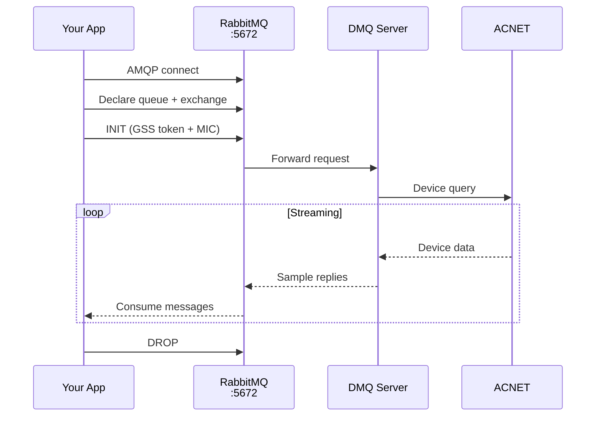

# DMQ

RabbitMQ-based backend that communicates with ACNET via the DMQ impl1 server (DataBroker/Bunny OAC/DAE). Uses AMQP protocol with SDD binary encoding.



## Characteristics

- **Kerberos required**: All operations (reads, writes, streaming) require `KerberosAuth`
- **GSS-API signing**: Messages are signed with MIC for authentication
- **Shared streaming connection**: All subscriptions share a single AMQP connection via SelectConnection with multiple channels
- **Connection caching**: Write connections are cached per device for performance
- **Heartbeats**: Client sends heartbeats every 5 seconds to maintain connections

## Usage

```python
import pacsys
from pacsys import KerberosAuth

# All DMQ operations require Kerberos auth
auth = KerberosAuth()

# Read
with pacsys.dmq(auth=auth) as backend:
    value = backend.read("M:OUTTMP")

# Write
with pacsys.dmq(auth=auth) as backend:
    result = backend.write("M:OUTTMP", 72.5)

# Stream
with pacsys.dmq(auth=auth) as backend:
    with backend.subscribe(["M:OUTTMP@p,1000"]) as stream:
        for reading, _ in stream.readings(timeout=30):
            print(reading.value)
```

## Configuration

| Parameter | Default | Environment Variable |
|-----------|---------|---------------------|
| `host` | appsrv2.fnal.gov | `PACSYS_DMQ_HOST` |
| `port` | 5672 | `PACSYS_DMQ_PORT` |
| `vhost` | / | - |
| `timeout` | 5.0 | - |

## For the Curious: How DMQ Writes Work

A DMQ write involves a 4-step AMQP dance: channel setup (private exchange + queue), INIT handshake (GSS-signed `SettingRequest` to `amq.topic`), value send (routing key must exactly match INIT DRF string), and response consumption. Sessions are cached per device; subsequent writes skip steps 1-2.

<details>
<summary>Full protocol details</summary>

### 1. Channel Setup

Each write session gets its own AMQP channel with a private "mailbox":

```
Your client creates:
  - A topic exchange (random UUID name, e.g. "a1b2c3d4-...")
  - A queue bound to that exchange for R.# and Q routing keys

The exchange name is your "return address" - the DMQ server publishes
responses there so only you receive them.
```

### 2. The INIT Handshake

Before sending any data, your client must tell the DMQ server what it wants to do:

```
Client → amq.topic (routing key "I"):
  Body:    SettingRequest { dataRequest: ["Z:ACLTST.SETTING@N"] }
  Headers: gss-token (Kerberos authentication)
           signature (MIC of body + message properties)
           host-address (your IP)
  Props:   reply_to = "a1b2c3d4-..."  ← your exchange name
```

The DMQ server processes this INIT and registers a "setter" keyed by the
exact string `"Z:ACLTST.SETTING@N"`. This string matching is critical later.

### 3. Sending the Value

After a brief delay for INIT processing, the client sends the actual value:

```
Client → your exchange (routing key "S.Z:ACLTST.SETTING@N"):
  Body:    DoubleSample { value: 45.0, time: <now> }
  Headers: signature (MIC of body + messageId + correlationId + hostAddress)
           host-address (your IP)
  Props:   message_id, correlation_id ← for matching the response
```

The routing key **must** be `S.` followed by the **exact** DRF string used
in the INIT. The server extracts everything after `S.` and looks it up
in its setter registry. A mismatch means "invalid request".

### 4. The Response

The impl1 server sends back one R-keyed response on your exchange:

```
R.Z:ACLTST.SETTING@N  →  DoubleSample { value: 45.0 }    ← actual result
                     (or)  ErrorSample { error: -98 }      ← if something went wrong
```

The R-keyed reply is the authoritative result from ACNET. Note that impl1
sends `correlationId=""` (empty) on write responses, so the client uses
FIFO ordering to match responses to pending writes.

### What Can Go Wrong

| Error | Code | Cause |
|-------|------|-------|
| `DMQ_INVALID_REQUEST` | -98 | Routing key doesn't match INIT dataRequest (exact string match!) |
| `DMQ_SECURITY_VIOLATION` | -99 | MIC signature verification failed (wrong sign format) |
| `DMQ_PENDING` | 1 | Not an error - INIT still processing, wait for final status |

For writes, impl1 sends PENDING only after full job creation (`InitTask.run`),
which includes ACNET backend setup. This can take up to 5s (`CLIENT_INIT_RATE`).
For reads, PENDING is sent immediately.

The signing format must match Java's `GSSUtil.createBody`: the MIC covers not
just the binary body but also `messageId`, `correlationId`, `replyTo`, `appId`,
and `hostAddress`, separated by null bytes. Getting this wrong is a silent
authentication failure.

### Session Reuse

Creating a write session (channel + exchange + INIT) takes time, so pacsys
caches sessions per device and maintains a pool of pre-warmed "standby"
channels. Subsequent writes to the same device reuse the existing session,
skipping steps 1-2 entirely. Sessions are cleaned up after 10 minutes of
inactivity.

</details>

## When to Use

- When you have Kerberos credentials and need full read/write/stream
- As an alternative to DPM/HTTP when talking to ACNET via RabbitMQ infrastructure
- When the DMQ server is the preferred access point for your environment

<details>
<summary>References</summary>

- [DMQ Protocol Documentation (PDF)](https://beamdocs.fnal.gov/AD/DocDB/0038/003860/001/dmq.pdf)

</details>
