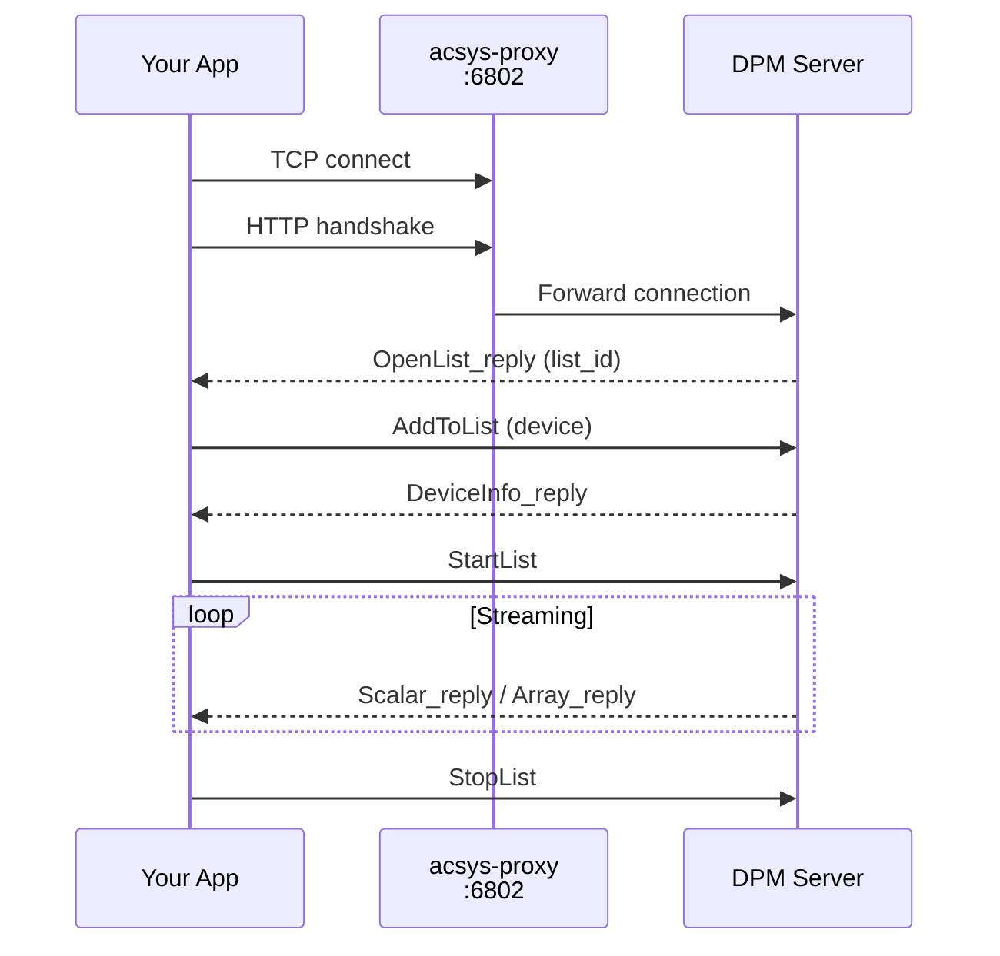

# DPM/HTTP

The primary backend. Uses a custom binary protocol ("PC" format) over TCP.



## Characteristics

- **Connection pooling**: Multiple reads share pooled connections
- **Independent subscriptions**: Each `subscribe()` creates its own TCP connection
- **Kerberos auth**: Required for writes, optional for reads
- **Heartbeats**: Server sends `ListStatus_reply` every ~2 seconds

## Usage

```python
import pacsys

# Read-only (uses global backend)
value = pacsys.read("M:OUTTMP")

# Explicit backend
with pacsys.dpm() as backend:
    value = backend.read("M:OUTTMP")

# With authentication for writes
from pacsys import KerberosAuth

with pacsys.dpm(auth=KerberosAuth(), role="testing") as backend:
    result = backend.write("M:OUTTMP", 72.5)
```

## Write Permissions (Kerberos)

When you call `write()`, the DPM server checks whether your Kerberos identity is allowed to set the target device. The server uses two authorization paths, tried in order:

**Path 1 - Role + device allowlist.** The server looks up your Kerberos principal in the DB, checks that you have the requested role (e.g. `"testing"`), then checks that the target device is allowed for that role.

**Path 2 - Console class bitmask (fallback).** Only executed if role check fails. Each console user has a `classes` bitmask (e.g. `MCR`, `ASTA`, ...) and each device has a `protection_mask`. If `user.classes & device.protection_mask > 0` (i.e. values overlap on at least 1 bit), the write is allowed.


## Configuration

| Parameter | Default | Environment Variable |
|-----------|---------|---------------------|
| `host` | acsys-proxy.fnal.gov | `PACSYS_DPM_HOST`* |
| `port` | 6802 | `PACSYS_DPM_PORT`* |
| `pool_size` | 4 | `PACSYS_POOL_SIZE`* |

*Environment variables only affect the global (implicit) backend used by `pacsys.read()` etc. The `pacsys.dpm()` factory uses parameters passed directly.
