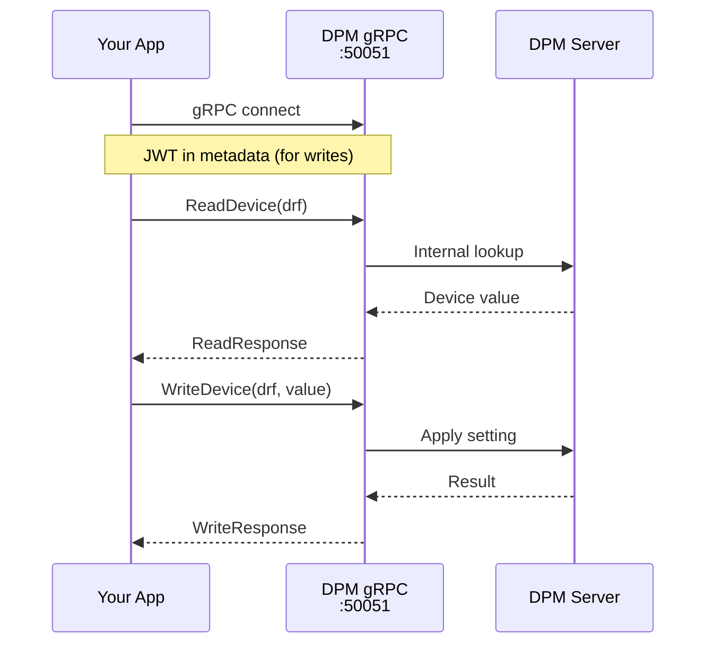

# DPM/gRPC

Modern gRPC interface to DPM. Will be the default in the future. Uses Protocol Buffers for serialization.



## Characteristics

- **Strongly typed**: Protobuf schema with clear message types
- **JWT authentication**: Token-based auth for writes
- **Reachability**: Only accessible on controls network
- **Timestamps**: Proto timestamps carry nanosecond precision but are currently truncated to microseconds by Python `datetime`. All timestamps are UTC-aware. The timestamp type may change in the future to preserve full nanosecond fidelity.

## Usage

```python
import pacsys
from pacsys import JWTAuth

# Read-only
with pacsys.grpc() as backend:
    value = backend.read("M:OUTTMP")

# With explicit JWT authentication (or set PACSYS_JWT_TOKEN env var for automatic auth)
auth = JWTAuth(token="eyJ...")
with pacsys.grpc(auth=auth) as backend:
    result = backend.write("M:OUTTMP", 72.5)
```

Readings with a positive ACNET warning are usable when they include data:
both `reading.ok` and `reading.is_warning` are true. Batched and logger results
retain all usable samples and the first warning's status and message. Samples
with errors or warnings without data are unusable.

Writes reject names reserved for DPM list directives, such as `#AB:CD` and
`#ROLE:x`, with a failed `WriteResult` for that item. Other valid items in the batch
are sent normally and retain their matching statuses. Numeric ACNET names such
as `#:123` are allowed. This applies to both sync and async backends.

Sync and async subscriptions retry `UNAVAILABLE` and `CANCELLED` stream errors
indefinitely until stopped, with exponential backoff from 1 to 30 seconds. Each
retryable error logs a warning and invokes the optional `on_error` callback,
including in iterator mode. `handle.exc` is reserved for terminal errors and
remains `None` during retries. `readings(timeout=...)` limits iteration time, not
the subscription's lifetime; stop the subscription to end retries.

## Configuration

| Parameter | Default | Environment Variable |
|-----------|---------|---------------------|
| `host` | dce08.fnal.gov | `PACSYS_GRPC_HOST` |
| `port` | 50051 | `PACSYS_GRPC_PORT` |
| `auth` | None | `PACSYS_JWT_TOKEN` |

Both sync and async backends use a five-minute keepalive interval for active
RPCs, with a ten-second acknowledgement timeout. This matches gRPC's
default server minimum and avoids disconnecting quiet subscriptions for excessive
pings. Idle channels without active RPCs do not send keepalive pings. Detecting a
silent connection loss can therefore take about five minutes plus ten seconds.

## Write Permissions (JWT)

JWT tokens are introspected server-side via a Keycloak endpoint. Your token's `realm_access.roles` determine which devices you can write to. Roles are mapped to ACNET console classes (e.g. `MCR`, `ASTA`, ...). The same bitwise check logic is applied as for DPM/HTTP.
