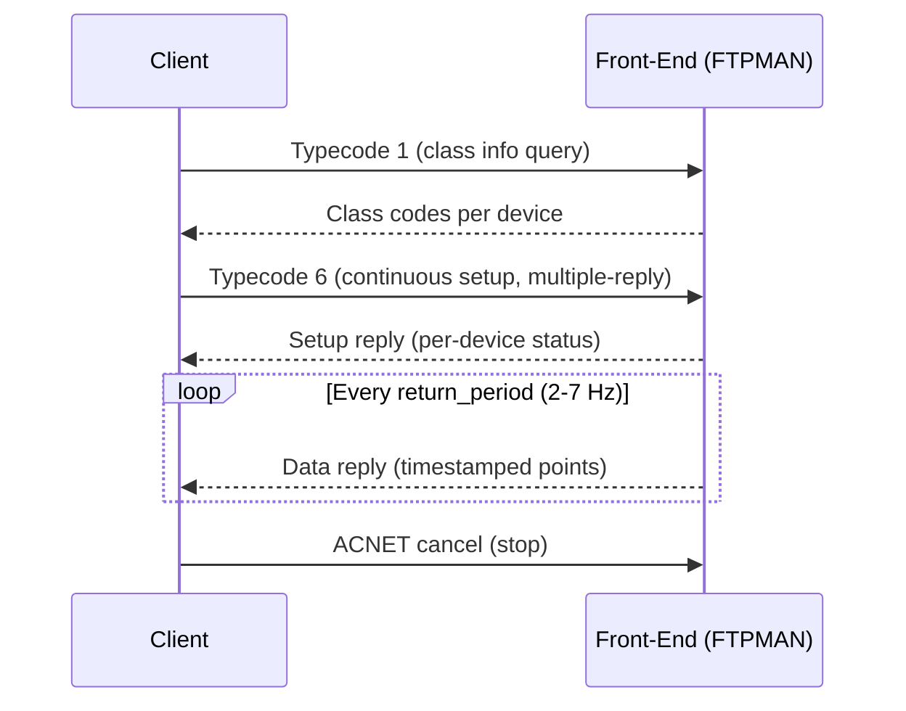
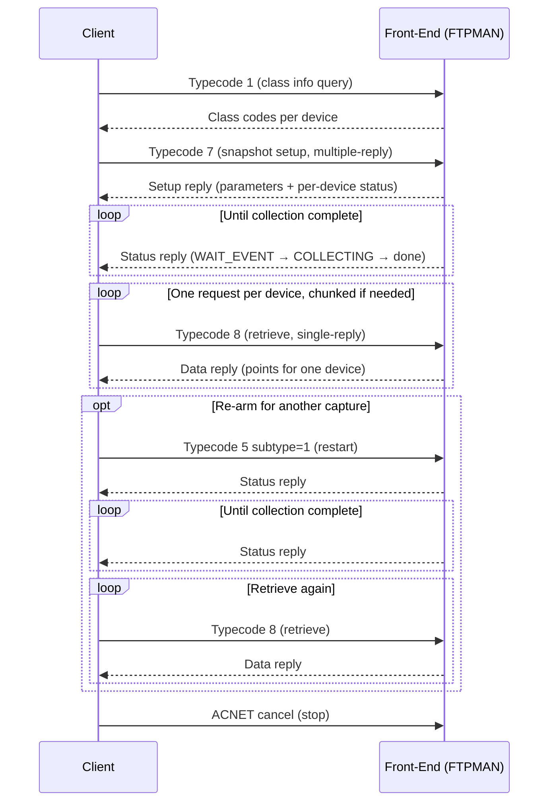

# FTPMAN Protocol

!!! danger "Direct front-end access -- use with caution"
    This module communicates **directly with front-end hardware controllers**, bypassing all central services. Incorrect requests can disrupt data collection for other users, preempt active plots, and impact operations.

    **Prefer higher-level alternatives whenever possible:**

    - **Continuous streaming up to 1440 Hz**: Use `pacsys.subscribe()` with a DPM backend -- DPM proxies FTP requests to front-ends on your behalf with proper resource management.
    - **Snapshot plots**: Currently only available through this direct protocol. Use the `FTPClient` API rather than building raw packets.

    Only use the direct FTPMAN protocol when you need snapshot capability or when DPM/DMQ cannot meet your requirements. Always use the lowest reasonable priority (0) and clean up resources promptly.

FTPMAN (Fast Time Plot Manager) is the ACNET protocol for high-frequency data acquisition from front-end controllers. It supports two modes:

- **Continuous plots (FTP)**: real-time streaming at rates up to 1440 Hz
- **Snapshot plots (SNP)**: triggered capture of up to 2048+ points at rates up to 20 MHz

All FTPMAN packets are ACNET request/reply payloads sent to the **FTPMAN** task on front-end nodes. All fields use **little-endian** byte order.

## Using pacsys

### Query Capabilities

```python
from pacsys.acnet import AcnetConnectionTCP, FTPClient, FTPDevice

with AcnetConnectionTCP() as conn:
    conn.connect()
    ftp = FTPClient(conn)

    node = conn.get_node("MUONFE")
    dev = FTPDevice(di=27235, pi=12, ssdn=b"\x00\x00B\x00?!\x00\x00")

    codes = ftp.get_class_codes(node, dev)
    print(f"FTP class: {codes.ftp}, Snapshot class: {codes.snap}")
```

### Continuous Streaming

```python
from pacsys.acnet import AcnetConnectionTCP, FTPClient, FTPDevice

with AcnetConnectionTCP() as conn:
    conn.connect()
    ftp = FTPClient(conn)
    node = conn.get_node("MUONFE")
    dev = FTPDevice(di=27235, pi=12, ssdn=b"\x00\x00B\x00?!\x00\x00")

    with ftp.start_continuous(node, [dev], rate_hz=1440) as stream:
        for batch in stream.readings(timeout=1.0):
            for di, points in batch.items():
                for pt in points:
                    print(f"Device {di}: ts={pt.timestamp_us} us, val={pt.raw_value}")
```

### Snapshot Capture

```python
from pacsys.acnet import AcnetConnectionTCP, FTPClient, FTPDevice

with AcnetConnectionTCP() as conn:
    conn.connect()
    ftp = FTPClient(conn)
    node = conn.get_node("MUONFE")
    dev = FTPDevice(di=27235, pi=12, ssdn=b"\x00\x00B\x00?!\x00\x00")

    # Default arm_source=2 (clock) with all-0xFF events = immediate arm
    with ftp.start_snapshot(
        node=node,
        devices=[dev],
        rate_hz=1440,
        num_points=100,
        snap_class_code=13,  # enables auto skip_first_point
    ) as snap:
        # Wait for collection (replaces manual sleep)
        snap.wait(timeout=10.0)

        # Retrieve data
        points = snap.retrieve(device_index=0)
        for pt in points[:5]:
            print(f"ts={pt.timestamp_us} us, raw={pt.raw_value}")
```

### Clock-Event Armed Snapshot

```python
from pacsys.acnet import AcnetConnectionTCP, FTPClient, FTPDevice

with AcnetConnectionTCP() as conn:
    conn.connect()
    ftp = FTPClient(conn)
    node = conn.get_node("MUONFE")
    dev = FTPDevice(di=27235, pi=12, ssdn=b"\x00\x00B\x00?!\x00\x00")

    # Arm on TCLK event 0x02 -- each byte is a literal event number
    arm_events = b"\x02" + b"\xff" * 7

    with ftp.start_snapshot(
        node=node,
        devices=[dev],
        rate_hz=50,
        num_points=100,
        arm_events=arm_events,
        snap_class_code=13,
    ) as snap:
        snap.wait(timeout=15.0)  # may wait up to one supercycle (~5s)
        points = snap.retrieve(device_index=0)
        print(f"Got {len(points)} points")
```

### Restart (Re-arm) Cycle

```python
from pacsys.acnet import AcnetConnectionTCP, FTPClient, FTPDevice

with AcnetConnectionTCP() as conn:
    conn.connect()
    ftp = FTPClient(conn)
    node = conn.get_node("MUONFE")
    dev = FTPDevice(di=27235, pi=12, ssdn=b"\x00\x00B\x00?!\x00\x00")

    with ftp.start_snapshot(
        node=node,
        devices=[dev],
        rate_hz=1440,
        num_points=100,
        snap_class_code=13,
    ) as snap:
        for cycle in range(3):
            snap.wait(timeout=10.0)
            points = snap.retrieve(device_index=0)
            print(f"Cycle {cycle}: {len(points)} points")
            snap.restart()  # re-arm for next capture
```

### Sequential Multi-Chunk Retrieval

For large captures that exceed `retrieval_max` (512 for most classes):

```python
from pacsys.acnet import AcnetConnectionTCP, FTPClient, FTPDevice

with AcnetConnectionTCP() as conn:
    conn.connect()
    ftp = FTPClient(conn)
    node = conn.get_node("MUONFE")
    dev = FTPDevice(di=27235, pi=12, ssdn=b"\x00\x00B\x00?!\x00\x00")

    with ftp.start_snapshot(
        node=node,
        devices=[dev],
        rate_hz=1440,
        num_points=2048,
        snap_class_code=13,
    ) as snap:
        snap.wait(timeout=10.0)

        # Retrieve in 512-point chunks using sequential access.
        # First chunk: skip metadata point. Subsequent: don't skip.
        all_points = []
        first = True
        while True:
            points = snap.retrieve(
                device_index=0,
                num_points=512,
                point_number=-1,       # sequential access
                skip_first_point=first,
            )
            first = False
            if not points:
                break
            all_points.extend(points)

        print(f"Total: {len(all_points)} points")  # expect 2047
```

### Class Code Lookup

```python
from pacsys.acnet.ftp import get_ftp_class_info, get_snap_class_info

ftp_info = get_ftp_class_info(16)   # C290 MADC
snap_info = get_snap_class_info(13) # C290 MADC snapshot
print(f"FTP max rate: {ftp_info.max_rate} Hz")
print(f"Snap max rate: {snap_info.max_rate} Hz, "
      f"max points: {snap_info.max_points}, "
      f"has_timestamps: {snap_info.has_timestamps}")
```

## Continuous Plot Flow



## Snapshot Plot Flow



## Typecodes

| Typecode | Operation | Reply Mode | Description |
|:--------:|-----------|:----------:|-------------|
| 1 | Class info query | Single | Query FTP/snapshot capabilities per device |
| 5 | Snapshot control | Single | Restart (re-arm) or reset retrieval pointers |
| 6 | Continuous setup | Multiple | Start streaming data at specified rate |
| 7 | Snapshot setup | Multiple | Arm snapshot capture with trigger parameters |
| 8 | Snapshot retrieve | Single | Retrieve captured data (one device per request) |

## Class Code Query (Typecode 1)

Before starting any plot, clients query the front-end for each device's capabilities.

### Request

```
[2B: typecode = 1]
[2B: num_devices]
Per device (12B):
    [4B: DIPI]      Property-Device Index Pair
    [8B: SSDN]      Sub-System Device Number
```

### Reply

```
[2B: error (signed)]       Overall status
Per device (6B):
    [2B: error (signed)]   Per-device status
    [2B: FTP class code]   Continuous plot class (0 = unsupported)
    [2B: SNP class code]   Snapshot class (0 = unsupported)
```

### FTP Class Codes (Continuous)

Codes 1-10 are defunct. Only 11+ use the current typecode 6 protocol.

| Code | Hardware | Max Rate |
|:----:|----------|:--------:|
| 11 | C190 MADC channel | 720 Hz |
| 12 | Internet Rack Monitor | 1000 Hz |
| 13 | MRRF MAC MADC channel | 100 Hz |
| 14 | Booster MAC MADC channel | 15 Hz |
| 15 | 15 Hz (Linac, D/A's, etc.) | 15 Hz |
| 16 | C290 MADC channel | 1440 Hz |
| 17 | 15 Hz from data pool | 15 Hz |
| 18 | 60 Hz internal | 60 Hz |
| 19 | 68K (MECAR) | 1440 Hz |
| 20 | Tev Collimators | 240 Hz |
| 21 | IRM 1 KHz Digitizer | 1000 Hz |
| 22 | DAE 1 Hz | 1 Hz |
| 23 | DAE 15 Hz | 15 Hz |

### Snapshot Class Codes

Codes 1-9 are defunct. Only 11+ use the current typecode 7 protocol.

| Code | Hardware | Max Rate | Max Points | Timestamps | Triggers |
|:----:|----------|:--------:|:----------:|:----------:|:--------:|
| 11 | C190 MADC channel | 66 KHz | 2048 | Yes | No |
| 12 | 1440 Hz internal | 1440 Hz | 2048 | Yes | No |
| 13 | C290 MADC channel | 90 KHz | 2048 | Yes | No |
| 14 | 15 Hz internal | 15 Hz | 2048 | Yes | No |
| 15 | 60 Hz internal | 60 Hz | 2048 | Yes | No |
| 16 | Quick Digitizer (Linac) | 10 MHz | 4096 | No | No |
| 17 | 720 Hz internal | 720 Hz | 2048 | Yes | No |
| 18 | New FRIG circ buffer | 1 KHz | 16384 | Yes | Yes |
| 19 | Swift Digitizer | 800 KHz | 4096 | No | No |
| 20 | IRM 20 MHz Quick Digitizer | 20 MHz | 4096 | No | No |
| 21 | IRM 1 KHz Digitizer | 1 KHz | 4096 | No | No |
| 22 | DAE 1 Hz | 1 Hz | 4096 | Yes | Yes |
| 23 | DAE 15 Hz | 15 Hz | 4096 | Yes | Yes |
| 24 | IRM 12.5 KHz Digitizer | 12.5 KHz | 4096 | No | No |
| 25 | IRM 10 KHz Digitizer | 10 KHz | 4096 | No | No |
| 26 | IRM 10 MHz Digitizer | 10 MHz | 4096 | No | No |
| 28 | New Booster BLM | 12.5 KHz | 4096 | No | No |

The **Timestamps** column determines whether snapshot data includes per-point timestamps or just raw values. Clients must know this from the class code before retrieving data.

## Continuous Plot (Typecode 6)

### Setup Request

```
[2B: typecode = 6]
[4B: task_name]          RAD50-encoded unique name (auto-generated)
[2B: num_devices]
[2B: return_period]      15 Hz ticks between replies (1-7)
[2B: msg_size_words]     Max reply buffer size in 16-bit words
[2B: ref_word]           Reserved (0)
[2B: start_time]         Reserved (0)
[2B: stop_time]          Reserved (0)
[2B: priority]           0=user, 1=other CR, 2=main CR, 3=SDA
[2B: current_time_15hz]  For FEs without 0x02 event hardware (0)
[10B: zeros]             Reserved
Per device (22B):
    [4B: DIPI]
    [4B: offset]         Byte offset into device data
    [8B: SSDN]
    [2B: sample_period]  In 10 us units
    [4B: zeros]          Reserved
```

**Buffer size calculation**: `msg_size = min(1.5 * (4 + 3*N + dataWords * rate * period/15), 4160)` where 4160 = MAX_ACNET_MSG_SIZE / 2.

**Behavior notes**:

- Sent as a **multiple-reply** ACNET request. Cancel to stop.
- If ANY device cannot be accommodated, the entire request is rejected.
- Each plotting task can have only one active plot. A new request auto-cancels the previous one.
- The sample period (10 us units) is the only way to specify collection rate. Event-based sampling is not supported (use RETDAT for that).
- Data length (2 or 4 bytes) is not specified in the request; the FE uses the default from the device database.

### First Reply (Setup Acknowledgement)

```
[2B: error (signed)]
[2B: reply_type = 1]
Per device (2B):
    [2B: error (signed)]   Per-device status
```

If `error < 0`, the request failed and this is the last reply. Positive per-device status codes are informational (see [FTP Status Codes](#ftp-status-codes)).

### Data Replies

```
[2B: error (signed)]
[2B: reply_type = 2]
[4B: reserved]
Per device (6B):
    [2B: error (signed)]       Per-device status (negative = skip this device's data)
    [2B: ptr_to_data]          Byte offset from start of reply to first data point
    [2B: num_points]           Number of points returned
Variable data per device:
    Per point:
        [2B: timestamp]        100 us resolution, relative to TCLK event 0x02
        [2B or 4B: value]      Raw data value (2 or 4 bytes per device's data_length)
```

**Error handling**: Only negative values in the header `error` field indicate errors. Positive values (including `FTP_COLLECTING`) are informational. Per-device errors use `!= 0` (any non-zero skips that device's data for this reply).

**Timestamps**: Unsigned 16-bit values with 100 microsecond resolution, reset on each TCLK event 0x02 (which occurs every 5 seconds). Multiply by 100 to convert to microseconds.

## Snapshot Plot (Typecodes 7, 8, 5)

Snapshot plots have three phases: setup (arm), retrieval, and optional restart/reset.

### Setup Request (Typecode 7)

Total size: 68 + 20*N bytes.

```
[2B: typecode = 7]
[4B: task_name]              RAD50-encoded unique name (auto-generated)
[2B: num_devices]
[2B: arm_trigger_word]       See Arm and Trigger Selection Word below
[2B: priority]               Same as continuous (0-3)
[4B: rate_hz]                Data sample rate in Hz
[4B: arm_delay]              Microseconds (post-trigger) or sample count (pre-trigger)
[8B: arm_clock_events]       Literal event numbers (NOT a bitmask), 0xFF = unused
[4B: sample_trigger_events]  Literal event numbers (NOT a bitmask), 0xFF = unused
[4B: num_points]             Points to collect per device
[4B: arm_dipi]               Arm device DIPI (if arm source = device)
[4B: arm_offset]             Arm device byte offset
[8B: arm_ssdn]               Arm device SSDN
[4B: arm_mask]               Arm condition mask
[4B: arm_value]              Arm condition value
[8B: zeros]                  Reserved
Per device (20B):
    [4B: DIPI]
    [4B: offset]
    [8B: SSDN]
    [4B: zeros]              Reserved
```

**Behavior notes**:

- Sent as a **multiple-reply** ACNET request. Cancel to abort.
- Unlike continuous plots, the request succeeds if ANY device can be accommodated (partial success).
- The FE may adjust parameters (rate, num_points, etc.) to match hardware capabilities. Actual values are returned in the setup reply.
- The arm condition (for device-triggered arm): `(device_value & mask) == value`.

### Arm and Trigger Selection Word

The Java DPM implementation uses a slightly different bit layout from the original 1998 protocol spec, with a "new protocol" flag at bit 7:

| Field | Bits | Values |
|-------|:----:|--------|
| AS (Arm Source) | 1:0 | 0=device, 2=clock events, 3=external (AM specifies which) |
| AM (Arm Modifier) | 3:2 | 0-3, only meaningful when AS=3 |
| PM (Plot Mode) | 6:5 | 2=post-trigger, 3=pre-trigger (0 and 1 are invalid) |
| NP (New Protocol) | 7 | Always 1 (indicates new typecode 7 protocol) |
| TS (Trigger Source) | 9:8 | 0=periodic (use rate_hz), 2=clock events, 3=external (TM specifies which) |
| TM (Trigger Modifier) | 11:10 | 0-3, only meaningful when TS=3 |

!!! warning "AS=1 (ARM_IMMEDIATELY) is not used"
    The protocol defines AS=1 as "arm immediately", but the Java SnapShotPool never sends it on the wire.  Even for immediate arming, it sends AS=2 (clock events) with all-0xFF arm events and arm_delay=0.  Some front-ends (ecbpm) reject AS=1.  The `pacsys` implementation follows this Java convention.

**Plot modes**:

- **Post-trigger (PM=2)**: After the arm condition, wait `arm_delay` microseconds, then collect `num_points` data points.
- **Pre-trigger (PM=3)**: Begin collecting immediately. After the arm condition, collect `arm_delay` more samples, then stop.

### Setup Reply

First reply after sending the setup request:

```
[2B: error (signed)]         FTP-level status (negative = fatal error)
[2B: arm_trigger_word]       Actual arm/trigger word chosen by FE
[4B: rate_hz]                Actual sample rate
[4B: arm_delay]              Actual arm delay
[8B: arm_events]             Actual arm clock events
[4B: num_points]             Actual number of points
Per device (18B):
    [2B: error (signed)]     Per-device status
    [4B: ref_point]          Reference point number (pre-trigger only)
    [4B: arm_sec]            Arm time, seconds since 1970-01-01
    [4B: arm_nsec]           Arm time, nanoseconds within second
    [4B: reserved]
```

**Short error replies**: If the front-end rejects the request outright, it may return only the 2-byte error field with no further data. Always check the error before attempting to parse the full reply.

**Per-device status**: Positive values are informational and expected:

| Status | Meaning |
|--------|---------|
| `FTP_PEND` [15 1] | Snapshot setup accepted, pending |
| `FTP_WAIT_EVENT` [15 2] | Armed, waiting for arm event |
| `FTP_WAIT_DELAY` [15 3] | Armed, waiting for delay |
| `FTP_COLLECTING` [15 4] | Data collection in progress |

Subsequent multiple-reply messages carry updated status as collection progresses.

### Retrieve Data (Typecode 8)

Sent as a **single-reply** request to retrieve captured data for one device at a time.

```
[2B: typecode = 8]
[4B: task_name]       RAD50-encoded (must match setup)
[2B: item_number]     1-based index into the setup device list
[2B: num_points]      Number of points to retrieve
[4B: point_number]    Starting point (0-based) or 0xFFFFFFFF for sequential access
```

Total: 14 bytes.

### Retrieve Reply

```
[2B: error (signed)]
[2B: num_points_returned]
Per point (variable):
    [2B: timestamp]       100 us resolution (only if class has_timestamps)
    [2B or 4B: value]     Raw data value
```

**Timestamps**: Whether timestamps are included depends on the snapshot class code. Classes like Quick Digitizer (code 16) and Swift Digitizer (code 19) return raw values only. Check `SnapClassInfo.has_timestamps` for the device's class.

**Post-trigger retrieval**: Data can be retrieved while collection is still in progress. Pre-trigger requires waiting until all data is collected.

### Restart / Reset (Typecode 5)

```
[2B: typecode = 5]
[4B: task_name]    RAD50-encoded (must match setup)
[2B: subtype]      1 = restart (re-arm), 2 = reset retrieval pointers
```

Total: 8 bytes.

**Restart** (subtype 1): Re-arms the snapshot with the same parameters. The front-end begins waiting for the arm condition again.

**Reset** (subtype 2): Resets the data retrieval pointers so subsequent typecode 8 requests return data from the beginning again.

Reply: `[2B: error (signed)]`

## FTP Status Codes

FTP uses ACNET facility 15. Status codes follow the standard `[facility error_number]` convention: negative = error, zero = success, positive = informational.

### Informational (positive)

| Code | Constant | Error # | Description |
|:----:|----------|:-------:|-------------|
| [15 4] | `FTP_COLLECTING` | +4 | Snapshot data collection in progress |
| [15 3] | `FTP_WAIT_DELAY` | +3 | Snapshot armed, waiting for time delay |
| [15 2] | `FTP_WAIT_EVENT` | +2 | Snapshot armed, waiting for arm event |
| [15 1] | `FTP_PEND` | +1 | Snapshot pending (setup accepted) |

### Errors (negative)

| Code | Constant | Error # | Description |
|:----:|----------|:-------:|-------------|
| [15 -1] | `FTP_INVTYP` | -1 | Invalid request typecode (software bug) |
| [15 -2] | `FTP_INVSSDN` | -2 | Invalid SSDN from database |
| [15 -5] | `FTP_FE_OUTOFMEM` | -5 | Front-end out of memory |
| [15 -6] | `FTP_NOCHAN` | -6 | No available MADC plot channels |
| [15 -7] | `FTP_NO_DECODER` | -7 | No available MADC clock decoders |
| [15 -8] | `FTP_FE_PLOTLIM` | -8 | Front-end plot limit exceeded |
| [15 -9] | `FTP_INVNUMDEV` | -9 | Invalid number of devices in request |
| [15 -10] | `FTP_ENDOFDATA` | -10 | End of data |
| [15 -11] | `FTP_FE_PLOTLEN` | -11 | Buffer length computation error |
| [15 -12] | `FTP_INVREQLEN` | -12 | Invalid request length |
| [15 -13] | `FTP_NO_DATA` | -13 | No data from MADC (transient or hardware) |
| [15 -14] | `FTP_INVREQ` | -14 | Retrieval doesn't match active setup |
| [15 -15] | `FTP_BADEV` | -15 | Wrong set of clock events |
| [15 -16] | `FTP_BUMPED` | -16 | Bumped by higher priority plot |
| [15 -17] | `FTP_REROUTE` | -17 | Internal front-end reroute error |
| [15 -19] | `FTP_UNSFREQ` | -19 | Unsupported frequency |
| [15 -20] | `FTP_BIGDLY` | -20 | Arm delay too long |
| [15 -21] | `FTP_UNSDEV` | -21 | Unsupported device type |
| [15 -22] | `FTP_SOFTWARE` | -22 | Internal front-end software error |
| [15 -23] | `FTP_NOTRDY` | -23 | Snapshot data not yet ready |
| [15 -24] | `FTP_ARCNET` | -24 | ARCNET communication error |
| [15 -25] | `FTP_BADARM` | -25 | Bad arm value, can't decode arm word |
| [15 -26] | `FTP_INVFREQ_FOR_HARDWARE` | -26 | Frequency unsupported by hardware |
| [15 -27] | `FTP_BAD_PLOT_MODE` | -27 | Bad plot mode in arm/trigger word |
| [15 -28] | `FTP_NO_SUCH_DEVICE` | -28 | Device not found for retrieval |
| [15 -29] | `FTP_DEVICE_IN_USE` | -29 | Device already has active retrieval |
| [15 -30] | `FTP_FREQ_TOO_HIGH` | -30 | Frequency exceeds front-end capability |
| [15 -31] | `FTP_NO_SETUP` | -31 | No matching setup for retrieval/restart |
| [15 -32] | `FTP_UNSUPPORTED_PROP` | -32 | Unsupported property |
| [15 -33] | `FTP_INVALID_CHANNEL` | -33 | Channel doesn't exist on device |
| [15 -34] | `FTP_NO_FIFO` | -34 | Missing FIFO board |
| [15 -35] | `FTP_BAD_DATA_LENGTH` | -35 | Invalid data length (expected 2 or 4) |
| [15 -36] | `FTP_BUFFER_OVERFLOW` | -36 | Front-end buffer overflow |
| [15 -37] | `FTP_NO_EVENT_SUPPORT` | -37 | Event-triggered sampling unsupported |
| [15 -38] | `FTP_TRIGGER_ERROR` | -38 | Internal trigger definition error |
| [15 -39] | `FTP_INV_CLASS_DEF` | -39 | Invalid class definition |
| [15 -40] | `FTP_NO_RANDOM_ACCESS` | -40 | Random access not supported |
| [15 -41] | `FTP_INVALID_OFFSET` | -41 | Non-zero data offset unsupported |
| [15 -42] | `FTP_NO_SNAPSHOT` | -42 | Device doesn't support snapshots |
| [15 -43] | `FTP_EVENT_UNAVAILABLE` | -43 | Clock event not available on front-end |
| [15 -44] | `FTP_NO_FTPMAN_INIT` | -44 | FTPMAN not initialized (send class query first) |
| [15 -100] | `FTP_BADTIMES` | -100 | UCD module timestamp error |
| [15 -101] | `FTP_BADRESETS` | -101 | Device timestamp reset error |
| [15 -102] | `FTP_BADARG` | -102 | Invalid argument |
| [15 -103] | `FTP_BADRPY` | -103 | Invalid reply from front-end |

All constants are available from `pacsys.acnet.errors`.

## Priority

Plots compete for front-end resources. Higher priority plots can preempt lower priority ones. FTP and snapshot share the same resource pool, so a high-priority snapshot can preempt a continuous plot.

| Priority | Context |
|:--------:|---------|
| 0 | User (default) |
| 1 | Other control room |
| 2 | Main control room |
| 3 | SDA (Save/Data/Analyze) |

## Implementation Notes

### Differences from the 1998 Protocol Spec

The Java codebase is the authoritative implementation. Key differences from the original FTPMAN spec:

1. **Arm/trigger word bit layout**: Java implementation adds a "new protocol" flag at bit 7.
2. **`task_name` field**: Each setup gets a unique RAD50-encoded name (e.g. SNP001, SNP002) so the FE can match retrieval/restart requests back to the correct setup.  The `FTPClient` generates these automatically.
3. **Error signedness**: All error fields are **signed 16-bit integers**. Only negative values indicate errors; positive values are informational status codes (e.g., `FTP_COLLECTING = +4`).
4. **ARM_IMMEDIATELY not used**: Java SnapShotPool never puts AS=1 on the wire. For immediate arming it uses AS=2 (clock events) with all-0xFF arm events. Some FEs (ecbpm) reject AS=1.
5. **`arm_clock_events` encoding**: Each byte is a **literal TCLK event number** (0x00–0xFD), NOT a bitmask.  0xFE and 0xFF mean "unused slot".  For event 0x02: `[0x02, 0xFF, 0xFF, 0xFF, 0xFF, 0xFF, 0xFF, 0xFF]`.

### Error Handling Pattern

FTPMAN replies have two levels of error checking:

1. **ACNET packet status** (`reply.status`): Checked first. If negative, the entire reply is an error and there is no payload to parse.
2. **FTP-level error** (first 2 bytes of payload): The FE-level status. When the front-end rejects a request, this may be the only data returned (just 2 bytes).

Always check error fields before attempting to parse reply data.

### acnetd Task Restrictions

Most `acnetd` instances (including all clx ones) restrict TCP client access to certain tasks (including FTPMAN). If you get an `AcnetRequestRejectedError` with the message "task is on the TCP reject list", you must either run your own acnetd instance on a node you have access to, or login to one of clx nodes and use AcnetConnectionUDP.

### DIPI Encoding

The Property-Device Index Pair packs the property index and device index into a single 32-bit value:

```python
dipi = (property_index << 24) | device_index
```

### SSDN

The Sub-System Device Number is an 8-byte opaque identifier from the device database. It encodes hardware-specific addressing (crate, slot, channel, etc.) and must be passed through unchanged. You can use D80 or ACL to find it.
