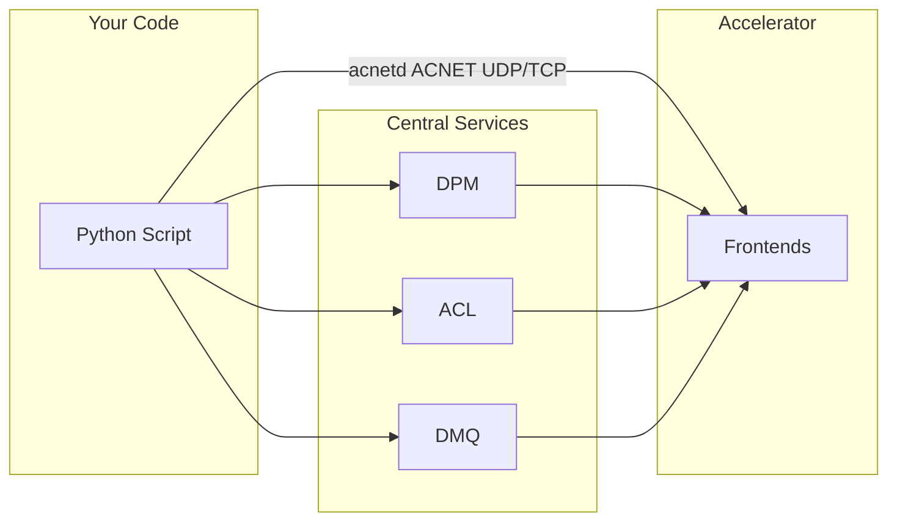

# PACSys - Pure-Python library for Fermilab's control system

## What is PACSys?

PACSys is a Python library that lets you interact with ACNET (aka ACSys) without needing to understand the underlying protocols. It provides a synchronous API with async internals to enable performance Python scripting.

High level features:

- **Read/Stream** device values (regular and Fast Time Plot)
- **Write** settings (with proper authorization)
- **Full data type support** - alarm, status, etc.
- **Notebook-friendly sync API** (async internals, sync public interface)

Low level features:

- **Raw ACNET UDP/TCP** - talk to tasks like a civilized member of ACNET society (via acnetd TCP/UDP)
- **FTPMAN implemented for snapshots** - yes, really
- **SSH utilities and ACL-over-SSH** - authenticated command runners, useful for ACL/DABBEL



## Backends

PACSys connects to services using backends:

| Backend | Protocol | Auth Required |
|---------|----------|---------------|
| **DPM/HTTP** | TCP + binary protocol | Kerberos (for writes) |
| **DPM/gRPC** | TCP + gRPC | JWT token (for writes) |
| **DMQ** | TCP + AMQP + binary protocol | Kerberos (mandatory) |
| **ACL/HTTP** | TCP + HTTP/CGI | None (read-only) |
| **SSH utilities** | TCP + SSH | Kerberos (mandatory) |

See [Backends](backends/index.md) for details.

## Backend API

```python
import pacsys

# Read device immediately
temperature = pacsys.read("M:OUTTMP")
print(f"Temperature: {temperature}")

# Stream data
with pacsys.subscribe(["M:OUTTMP@p,1000"]) as stream:
    for reading, _ in stream.readings(timeout=30):
        print(f"{reading.name}: {reading.value}")

# Write (requires authentication)
from pacsys import KerberosAuth
with pacsys.dpm(auth=KerberosAuth(), role="testing") as backend:
    backend.write("Z:ACLTST", 72.5)
```

## Device API

For device-centric workflows, the `Device` class provides an object-oriented interface with DRF validation, typed reads, and write verification:

```python
from pacsys import Device, ScalarDevice, Verify

dev = Device("M:OUTTMP")

# Read different properties
temperature = dev.read()               # READING (scaled)
setpoint = dev.setting()               # SETTING
is_on = dev.status(field="on")         # STATUS field (bool)
desc = dev.description()               # DESCRIPTION (str)

# Full reading with metadata
reading = dev.get()
print(f"{reading.value} {reading.units}")  # e.g. "72.5 DegF"

# Typed devices enforce return types
temp = ScalarDevice("M:OUTTMP")        # read() -> float

# Write with automatic readback verification
result = dev.write(72.5, verify=Verify(tolerance=0.5))

# Control commands
dev.on()
dev.off()
dev.reset()

# Immutable fluent modifications
periodic = dev.with_event("p,1000")
sliced = dev.with_range(0, 10)
```

See the [Device API guide](guide/device-api.md) for full documentation.

## Installation

```bash
pip install pacsys
```

## Next Steps

- [Quick Start Guide](quickstart.md) - Detailed examples for reading, writing, and streaming
- [DRF Format](drf.md) - Device addressing syntax (properties, events, ranges)
- [Backends](backends/index.md) - Connection options and architecture diagrams
- [API Reference](api.md) - Complete API documentation
