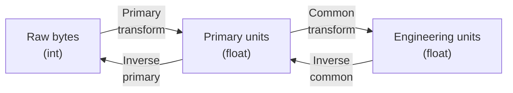

# Scaling Transforms

ACNET scaling system is a the two-stage pipeline that converts raw device data (ADC/DAC integers) to engineering units and back. PACSys provides a client-side implementationthat mirrors Java DPM scaling service.
!!! warning "Low-level feature - most users don't need this"
    It is recommended to use the official scaling service or avoid .RAW entirely.
    ACNET backends (DPM, gRPC, DMQ) return **already-scaled** engineering values. The `Scaler` class is only needed when working with time/performance-critical loops (e.g., fast setting of ramp tables).

## Overview

Every ACNET reading/setting property has two transform indices stored in the device database:

- **Primary transform** (`p_index`) -- converts raw bytes to "primary units" (hardware-level)
- **Common transform** (`c_index`) -- converts primary units to engineering units using device-specific constants (C1..C6)



The forward path (scale) is used for reading; the inverse path (unscale) is used for writing.

---

## The Scaler Class

```python
from pacsys import Scaler

# Direct construction
s = Scaler(p_index=2, c_index=2, constants=(100.0, 1.0, 0.0), input_len=2)
eng = s.scale(1000)        # raw int -> engineering units
raw = s.unscale(eng)       # engineering units -> raw int
```

### Constructor

```python
Scaler(p_index: int, c_index: int, constants: tuple[float, ...], input_len: int)
```

| Parameter | Description |
|-----------|-------------|
| `p_index` | Primary transform index (0-84, even numbers) |
| `c_index` | Common transform index (0-90, even numbers) |
| `constants` | Common transform constants (C1..C6 from device database) |
| `input_len` | Raw data width in bytes: 1, 2, or 4 |

### Methods

| Method | Direction | Description |
|--------|-----------|-------------|
| `scale(raw)` | raw -> engineering | Full pipeline: primary then common transform |
| `unscale(value)` | engineering -> raw | Full inverse: inverse common then inverse primary |
| `raw_to_primary(raw)` | raw -> primary | First stage only |
| `primary_to_common(p)` | primary -> engineering | Second stage only |
| `common_to_primary(v)` | engineering -> primary | Inverse second stage |
| `primary_to_raw(p)` | primary -> raw | Inverse first stage |

All methods accept `int`, `float`, or `numpy.ndarray`. Arrays are processed element-wise via `np.vectorize`.

### From DevDB

The typical workflow retrieves scaling parameters from the device database:

```python
import pacsys
from pacsys import Scaler

with pacsys.devdb(host="...") as db:
    info = db.get_device_info(["M:OUTTMP"])
    prop = info["M:OUTTMP"].reading  # PropertyInfo

    scaler = Scaler.from_property_info(prop, input_len=2)
    eng = scaler.scale(raw_int)
```

`PropertyInfo` carries the scaling parameters:

| Field | Type | Description |
|-------|------|-------------|
| `p_index` | `int` | Primary transform index |
| `c_index` | `int` | Common transform index |
| `coeff` | `tuple[float, ...]` | Common transform constants (C1..C6) |
| `primary_units` | `str` or `None` | Label for primary units |
| `common_units` | `str` or `None` | Label for engineering units |

---

## Primary Transforms

Primary transforms convert raw integer data to a floating-point "primary" value. Indexed by even numbers 0-84. The raw input is sign-extended based on `input_len` (1 byte = signed 8-bit, 2 bytes = signed 16-bit, 4 bytes = signed 32-bit).

### Transform Table

| Index | Formula | Description |
|-------|---------|-------------|
| 0 | `x / 3200.0` | 10.24V D/A converter |
| 2 | `x / 3276.8` | 10V D/A converter |
| 4 | `x / 6553.6` | 5V D/A converter |
| 6 | `x / 13107.2` | 2.5V D/A converter |
| 8 | `x + 32768.0` | 091 timing modules |
| 10 | `float(x)` | Identity (DEC word order) |
| 12 | `x / 320.0` | Temperature resistors |
| 14 | `float(m) * 10^c` | 2323 timing modules (BCD-like bit fields) |
| 16 | `intBitsToFloat(x)` | IEEE float, DEC word order |
| 18 | `x * 0.0010406` | Temperature resistors |
| 20 | `float(x)` (unsigned) | Unsigned interpretation (adds 65536 or 256 if negative) |
| 22 | `intBitsToFloat(wordSwap(x)) / 4.0` | VAX/DEC float to IEEE |
| 24 | `intBitsToFloat(wordSwap(x))` | IEEE float, 68000 word order |
| 26 | `(unsigned(x >> 8) & 0xFF) / 82.1865 - 0.310269935` | Pbar TWTs (high byte) |
| 28 | `wordSwap(x)` | 68000 longword (integer result) |
| 30 | `(byte) x` | Low byte, signed |
| 32 | `(byte)(x >> 8)` | High byte, signed |
| 34 | `x & 0xFF` | Low byte, unsigned |
| 36 | `(x >> 8) & 0xFF` | High byte, unsigned |
| 38 | `(x & 0xFF) / 82.1865 - 0.310269935` | Pbar TWTs (low byte) |
| 40 | `x / 256.0` | Temperature resistors |
| 42 | `(x & 0xFFFF) / 6553.6` | 16-bit unipolar 10V DAC |
| 44 | 7-digit BCD decode | Extracts 7 BCD nibbles from 28 bits |
| 46 | `unsigned_long(x)` | Unsigned 32-bit to double |
| 48 | `intBitsToFloat(x) / 0.036` | Temperature resistors, IEEE float |
| 50 | `intBitsToFloat(x)` clamped to [-10.24, 10.235] | IEEE float with clamping |
| 52 | `float(byteSwap(x))` | Byte-swap word or longword |
| 54 | `x * 0.0004882961516 + 4.0` | PLC 4-20mA (2 bytes, positive) |
| 56 | `(unsigned(x) - 32768.0) / 3276.8` | Stepper motor controllers (2 bytes) |
| 58 | `unsigned(x) / 256.0` | Unsigned divide by 256 |
| 60 | `500.0 * intBitsToFloat(x)` | IEEE float * 500 |
| 62 | `x / 6400.0` | 16-bit unipolar 0-10.24V DAC |
| 64 | `x / {128, 32768, 2147483648}` | Scaled to +/-1.0 (depends on byte length) |
| 66 | `x / 3200.0` (positive only) | Like index 0, enforces positive input |
| 68 | **Alternate scaling** | Delegates to string-based display |
| 70 | `x / 1000.0` | Divide by 1000 |
| 72 | `(unsigned(x) - 32768.0) / 3200.0` | Unsigned word, offset, scale (2 bytes) |
| 74 | `x * 0.00064088` | Allen-Bradley PLC 0-21mA (2 bytes) |
| 76 | `unsigned(wordSwap(x))` | Word-swapped unsigned 32-bit (4 bytes) |
| 78 | `intBitsToFloat(x)` clamped to [0.0, 5.0] | IEEE float with 0-5V clamp |
| 80 | `intBitsToFloat(x)` clamped to [0.0, 10.0] | IEEE float with 0-10V clamp |
| 82 | `x / 409.5` | 12-bit unipolar 0-10V (2 bytes) |
| 84 | `intBitsToFloat(byteReversal(x))` | IEEE float, full byte reversal (4 bytes) |

### Notes

- `intBitsToFloat` reinterprets a 32-bit integer as IEEE 754 float
- `wordSwap` exchanges the upper and lower 16-bit words of a 32-bit value
- `byteSwap` reverses all bytes (2 bytes: AB->BA, 4 bytes: ABCD->DCBA)
- Index 68 is a marker for "alternate scaling" (string-based display types like hex, enum, timestamp) -- not a numerical transform

---

## Common Transforms

Common transforms convert primary-unit values to engineering units using device-specific constants (C1..C6) stored in the database. Indexed by even numbers 0-90.

### Transform Table

| Index | Formula | Constants | Description |
|-------|---------|-----------|-------------|
| 0 | `X' = X` | 0 | Identity |
| 2 | `X' = (C1*X/C2) + C3` | 3 | Linear with scale and offset |
| 4 | `X' = (X - C1) / C2` | 2 | Offset then scale |
| 6 | `X' = C1*X / C2` | 2 | Ratio scale |
| 8 | `X' = C4 + (C1*X)/(C3 + C2*X)` | 4 | Rational function |
| 10 | `X' = C3 + C2/(C1*X)` | 3 | Inverse proportional |
| 12 | `X' = C5 + C4*X + C3*X^2 + C2*X^3 + C1*X^4` | 5 | 4th-degree polynomial |
| 14 | `X' = exp(C5 + C4*X + C3*X^2 + C2*X^3 + C1*X^4) - C6` | 6 | Exponential of 4th-degree polynomial |
| 16 | `X' = C2*exp(-X/C1) + C4*exp(-X/C3)` | 4 | Sum of two exponential decays |
| 18 | `X' = C3*exp(C2*(X+C1)) + C6*exp(C5*(X+C4))` | 6 | Sum of two exponential growths |
| 20 | `X' = log10(X) / (C1*log10(X) + C2)^2 + C3` | 3 | Logarithmic rational |
| 22 | `X' = C2 * 10^(X/C1)` | 2 | Power-of-10 scale |
| 24 | If X < C1: `C2*(C3*X + C4)`; else: `C2*exp(C5*X + C6)` | 6 | Piecewise linear/exponential |
| 26 | `X' = C6 + C5*X + C4*X^2 + C3*X^3 + C2*X^4 + C1*X^5` | 6 | 5th-degree polynomial |
| 28 | `X' = C3/(C2 + C1*X) + C4` | 4 | Inverse linear with offset |
| 30 | If X < C1: `C6`; else: `C5 + C4*X + C3*X^2 + C2*X^3` | 6 | Piecewise constant/cubic |
| 32 | `X' = C2*ln(C1*X + C4) + C3` | 4 | Natural logarithm |
| 34 | `X' = (C2 + C1*X) / (C4 + C3*X)` | 4 | Rational linear |
| 36 | `X' = C2*sqrt(X + C1) + C3` | 3 | Square root |
| 38 | If X > C6: `10^(C1 + C2*X + C3*exp(X) + C4/X + C5/X^2)`; else: `760000.0` | 6 | Vapor pressure (C3=0 skips exp term) |
| 40 | `X' = (C1*X/C2) + C3` | 6 | Same as #2 (C4=min, C5=max, C6=knob step) |
| 42 | If X < C1: `C2*X^2 + C3*X + C4`; else: `C2*exp(C5*X + C6)` | 6 | Piecewise quadratic/exponential |
| 44 | If X < C1: `C2*exp(C3*X)`; else: `C4*exp(C5*X)` | 5 | Piecewise exponential |
| 46 | If X < C1: `C2*exp(C3*X^2 + C4*X)`; else: `C5*exp(C6*X)` | 6 | Piecewise gaussian/exponential |
| 48 | `X' = C1 * C2^(1/X) * X^C3` | 3 | Power/exponential composite |
| 50 | `X' = C1 * acos(X/C2)` | 2 | Arc-cosine |
| 52 | If X < C1: `exp(C2*X + C3)`; else: `exp(C4*X + C5)` | 5 | Piecewise exponential |
| 54 | If X < C1: `exp(C2*X^2 + C3*X + C4)`; else: `exp(C5*X + C6)` | 6 | Piecewise gaussian/exponential |
| 56 | Table lookup, linear interpolation | 3 | **Not supported** (requires DB tables) |
| 58 | Table lookup, exponential interpolation | 3 | **Not supported** (requires DB tables) |
| 62 | `X' = C2 * (C3 + 10^(X/C1))` | 3 | Power-of-10 with additive constant |
| 64 | Hardcoded vapor pressure curves | 1 | C1=0 for N2, C1=1 for He |
| 66 | `X' = C1 * 2^(C2*(X+C3)) + C4` | 4 | Power-of-2 exponential |
| 68 | `X' = C6 * (C2*ln(C1*X + C4) + C3*X)^C5` | 6 | Log-power composite |
| 70 | `X' = C1*exp(-X/C2) + C3*exp(-X/C4) + C5*exp(-X/C6) + 4` | 6 | Triple exponential decay + 4 |
| 72 | `X' = C1 * 10^(C2 + C3*log10(X) + C4*log10(X)^2 + C5*log10(X)^3) + C6` | 6 | Log-polynomial power |
| 74 | `X' = (C1 + C2*X + C3*X^2) / (C4 + C5*X + C6*X^2)` | 6 | Rational quadratic (Pade) |
| 76 | If X < C1: `C2*X^C3`; else: `C4*exp(C5*X + C6)` | 6 | Piecewise power/exponential |
| 78 | `X' = C1 * 10^(C2*X + C3) + C4` | 4 | Power-of-10 linear |
| 80 | `X' = X` | 0 | Identity (second) |
| 82 | `X' = C2*log10(C1*X + C4) + C3` | 4 | Base-10 logarithm |
| 86 | If X < C1: `C3*X + C4`; if X > C2: `exp(C5*X + C6)`; between: log interpolation | 6 | Piecewise linear/log-interpolated/exponential |
| 88 | `X' = (C1 + C2*X + C3*X^2) / (1 + C4*X + C5*X^2 + C6*X^3)` | 6 | Pade approximant |
| 90 | Multifunction (range-based dispatch) | 3 | **Not supported** (requires DB tables) |

### Polynomial evaluation

Polynomial transforms (12, 14, 26, and the multifunction sub-transform 201) use Horner's method for numerical stability:

```
C5 + C4*X + C3*X^2 + C2*X^3 + C1*X^4
= C5 + X*(C4 + X*(C3 + X*(C2 + X*C1)))
```

### Piecewise transforms

Many common transforms are piecewise - they use C1 as a threshold to select between two branches. This handles sensors with different characteristics in different operating regions (e.g., linear at low values, exponential at high values).

---

## Inverse Transforms

Both primary and common transforms support an inverse path for writing raw values from engineering units.

### Analytical inverses

Many transforms have direct algebraic inverses:

- **Linear** (c2, c4, c6, c40): Direct formula inversion
- **Rational** (c8, c10, c28, c34): Algebraic with divide-by-zero checks
- **Logarithmic** (c32): `exp((X' - C3) / C2) / C1 - C4/C1`
- **Square root** (c36): `((X' - C3) / C2)^2 - C1`
- **Arc-cosine** (c50): `C2 * cos(X' / C1)`

### Binary search

For non-invertible transforms (most exponential and polynomial cases), the inverse is computed numerically using a two-phase binary search:

1. **Interval finding** - starting from the midpoint of the primary-unit range, expand outward to find an interval that brackets the target value
2. **Bisection** - refine to tolerance `uprlim / 131072` (capped at 0.0001), max 1000 iterations

The search bounds (`lowlim`, `uprlim`) are per-primary-transform constants defined in the Java source. A separate bisection method (max 30 iterations) handles the vapor pressure transform (c38).

---

## Unsupported Transforms

Three common transform categories require server-side database tables and are **not available** for client-side scaling:

| Index | Type | Why unsupported |
|-------|------|-----------------|
| 56 | Interpolation table (linear) | Requires `accdb.scaling_interpolation_table_values` |
| 58 | Interpolation table (exponential) | Requires `accdb.scaling_interpolation_table_values` |
| 90 | Multifunction (range dispatch) | Requires `accdb.scaling_multifunction_transforms` |

These raise `ScalingError`. Devices using these transforms must rely on server-side scaling (i.e., read the normal property or use DPM scaling service).

---

## Error Handling

```python
from pacsys import Scaler, ScalingError

s = Scaler(p_index=2, c_index=56, constants=(1.0, 0.0, 100.0), input_len=2)

try:
    s.scale(1000)
except ScalingError as e:
    print(e)  # "Requires interpolation table data..."
```

`ScalingError` is raised for:

- Unsupported transform indices (56, 58, 90)
- Unknown/invalid transform indices
- Overflow during inverse transforms (value doesn't fit in target byte width)

---

## numpy Support

`Scaler` accepts numpy arrays for batch conversion. numpy is an optional dependency - `Scaler` works without it for scalar values.

```python
import numpy as np
from pacsys import Scaler

s = Scaler(p_index=2, c_index=2, constants=(100.0, 1.0, 0.0), input_len=2)

raw = np.array([1000, 2000, 3000, 4000])
eng = s.scale(raw)      # array of engineering values
back = s.unscale(eng)   # array of raw integers
```

---

## Scaling for different properties

Scaling also applies to parts of other properties.

| Property | Scaling Type | Details |
|----------|-------------|---------|
| READING | Primary + Common | Standard two-stage pipeline |
| SETTING | Primary + Common | Same pipeline, different p_index/c_index/constants |
| STATUS | Basic/Digital status | Per-device bit masks, not numerical scaling |
| CONTROL | Control commands | Maps operation names to raw values |
| ANALOG alarm | Alarm scaling | 20-byte structure with tolerance values scaled through Primary+Common |
| DIGITAL alarm | Alarm scaling | 20-byte structure with nominal/mask values |

---

## Historical Notes

The scaling system dates back to the early 1980s PDP-11 era. The original API was a set of FORTRAN functions with names built from a two-letter convention - `PD` prefix, then source/target unit codes:

| FORTRAN routine | Direction | PACSys equivalent |
|-----------------|-----------|-------------------|
| `PDUDCU` | Unprocessed Data -> Common Units | `Scaler.scale()` |
| `PDCUUD` | Common Units -> Unprocessed Data | `Scaler.unscale()` |
| `PDUDPU` | Unprocessed Data -> Primary Units | `Scaler.raw_to_primary()` |
| `PDPUCU` | Primary Units -> Common Units | `Scaler.primary_to_common()` |
| `PDCUPU` | Common Units -> Primary Units | `Scaler.common_to_primary()` |
| `PDPUUD` | Primary Units -> Unprocessed Data | `Scaler.primary_to_raw()` |

Scaling parameters were (are?) stored in a **Process Data Block** (PDB) -- a variable-length byte structure fetched from the system database. The PDB contained the primary transform index, common transform index, six constants, unit labels, and flags. This maps directly to `PropertyInfo` dataclass and parts of the new gRPC protocol. More than 50 years of data structure vintage!

Two primary transforms have evolved since the PDP-11 era:

- **p22** was originally a null transform ("X = input") because DEC/VAX floating point was the native format. When the system moved to IEEE 754, this became a DEC-to-IEEE conversion (word-swap + divide by 4).
- **p28** was a null transform for Motorola 68000 longwords. Modern little-endian systems need a word-swap to interpret the big-endian 68000 format.

Basic status originally defined 4 attributes (ON, READY, REMOTE, POSITIVE). A 5th attribute (RAMP) was added later.

---

## References

- [ACNET Data Scaling Services](https://www-bd.fnal.gov/controls/database/scaling.txt) - original FORTRAN-era scaling specification
- [data-pool-manager](https://github.com/fermi-ad/data-pool-manager) - authoritative Java implementation

## See Also

- [Ramp Tables](specialized-utils/ramps.md) - uses scaling transforms for corrector magnet waveforms
- [DRF Format](drf.md) - `.RAW` qualifier and property syntax
- [Reading Devices](guide/reading.md) --standard (server-scaled) reads
